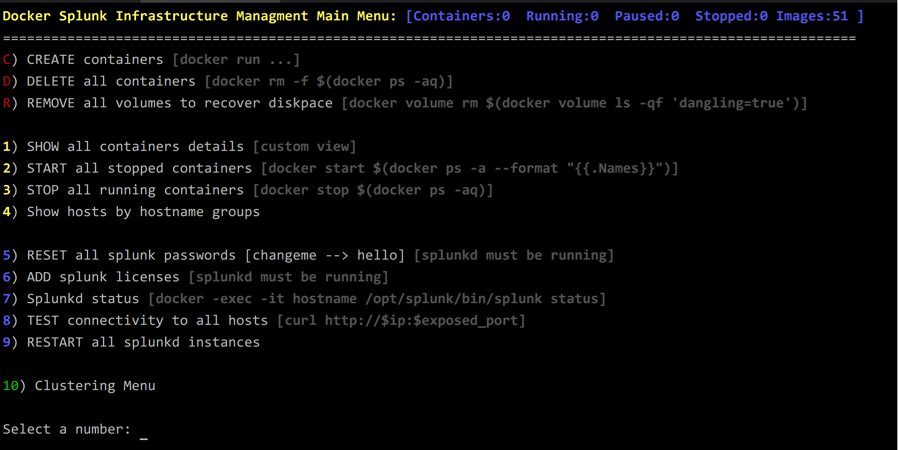
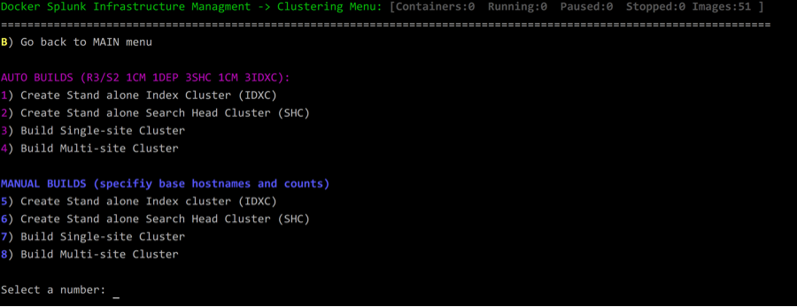
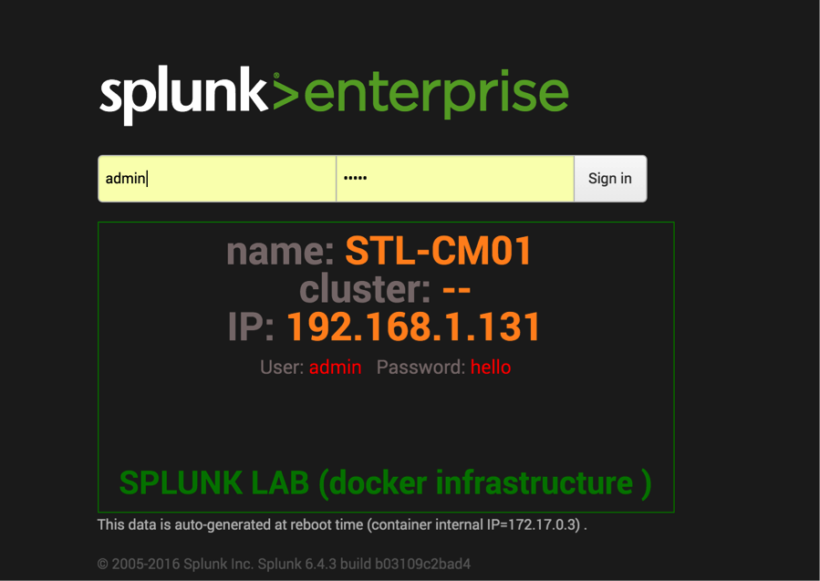

### **** IMPORTANT NOTE ****
As of Feb 29,2020 there is a confirmed IP aliasing bug in the latest docker release that applies to both Mac and Windows Docker Desktop versions. This bug breaks Splunk N' A Box. 

Downgrading to the latest 2.1.x version (2.1.0.5) solves the problem. Here are the direct download links.
Mac: https://download.docker.com/mac/stable/40693/Docker.dmg

Windows: https://download.docker.com/win/stable/40693/Docker%20Desktop%20Installer.exe

<br><br>

## Videos:
 :link: Splunk N' Box full presentation (.conf2017): https://youtu.be/tXeFwWTXtD4<br>

 :link: Run Splunk n' Box on USB stick:  https://youtu.be/qTAS1gvIGxM<Br>


## Introduction:

Have you ever wanted to create a multi-site cluster environment in your lab but you don’t have the resources for it? Have you ever wondered how does bucket replaction impact the file system level? Have you ever wanted to create a portable Splunk classroom but it is cost prohibitive? How about changing critical configuration without worrying about messing up your production environment? If you are like me; you must have dealt with similar challenges.<br>

Like with most people, you probably attempted to solve the problem by either throwing more hardware at it or by using a VM technology that does not scale well without additional resources (and cost). Well, I have a solution for you! But before that, I would like to welcome you to the world of DOCKER! The game changer that brought micro services to reality. Imagine that with a click of a button you can create 3-site cluster; each site has 3-SHs and 10-IDXs. Or maybe just instantly create a portable lab environment for training purposes. You may have heard of Docker, or you may even experiment with it trying to figure out how can I use it to help my Splunk needs. But learning Docker technology by itself is not helpful unless used in a context of a specific app like Splunk. To help my customers (and myself) I have created a wrapper bash script (~4000 lines) to manage Splunk instances builds. The script will allow you to create a pre-configured large number of Splunk infrastructure components without having to learn a single docker command and with minimal resources requirements.

In my small test environment, I was able to quickly bring upward of 40+ Splunk Docker containers for a classroom lab using low powered Intel NUC device (i3 16GB ram, 128G SSD). What’s impressive about Docker is the resource utilization on the docker-host is tiny compared to a VM based build. I need to emphasize the fact that I have not tested builds under heavy load (either user traffic or data ingestion). However, I believe it is just a matter of sizing the hardware appropriately.<br>


## Feature list:

- Menu driven and user friendly interface to manage splunk docker containers.<br>
- Continues status bar feedback communicating docker environment state.<br>
- MacOS run can can utitlize voice (siri). Check the CLI options.<br>
- Tunning speed (useful with fast CPU hosts).<br>
- Extensive error checking and validation.<br>
- Support for multiple Splunk versions (images).<br>
- Adaptive load control during cluster build (throttle execution if exceeds 4 x cores).<br>
- Built-in dynamic hostnames and IPs allocation (no need for proxy container like NGINX)<br>
- Automatically create & configure large number of Splunk hosts very fast.<br>
- Different levels of logging (show docker commands executed).<br>
- Fully configured multi & single site cluster builds (including LM,CM, DEP, DMC servers).<br>
- Manual and automatic cluster builds.<br>
- Modular design that can easily be converted to a higher-level language like Python.<br>
- Custom login screen (helpful for lab & Search Parties scenarios).<br>
- Low resources requirements compared to VM based solutions.<br>
- Eliminate the need to learn docker CLI (but you should).<br>
- MacOS & Linux support.<br>
- Works with windows10 WSL (Windows Subsystem for Linux) Ubuntu bash.<br>
- Automatic online script upgrade (with version check).<br>
- AWS EC2 aware (shows the NATed IPs)<br>


## How to install?

Source code is posted here: https://github.com/mhassan2/splunk-n-box<br>

```Ruby
cd ~
git clone https://github.com/mhassan2/splunk-n-box
cd splunk-n-box
cp <your_valid_lic_files> splunk_licenses/
./splunknbox.sh
```

## How does it work?

Once you have your Ubuntu up and running, please follow the instructions for installing Docker https://docs.docker.com/engine/installation/linux/ubuntulinux/<br>
Please be aware that Ubuntu 14.04 did not work very well for me. There is a bug around mounting docker volumes. Your mileage may vary if you decide to use CentOS or equal Linux distribution.<br>
For OSX see https://docs.docker.com/engine/installation/mac/<br>

When you run the scripts for the first time, it will check to see if you have any IP aliases available (the range specified in the script). If not; then it will configure IP aliases 192.168.1.100-254. The aliased IPs will be automatically mapped, at container creation time, to the internal docker IP space (172.18.0.0/24). You should be able to point your browser to any NATed IP on port 8000, and that will get you directly to the container. During my research, I haven’t seen many people using this technique, and they mostly opt for changing the ports or using a proxy container. My approach is to keep the standard Splunk ports (8000, 8089, 9997, etc.) and use iptable NATs to make the containers visible to the outside world.  This trick will save you a lot of headaches when dealing with creating a large number of Splunk containers (aka hosts). Running under OSX, I used private network segment 10.0.0.0/24. The assumption here is you don't need to NAT to the outside world and everything will be local to your MAC laptop. Windows and OSX do not support Linux c-groups natively. Therefore there is an additional layer of virtualization required, which will impact performance.<br>


## Splunk image(s):
All splunk images (with multiple versions) are pre-built and posted to docker hub. The script will utilize this URL during execution to download the desired image<br>
```
https://hub.docker.com/r/splunknboxk/splunk_x.x.x/
```

## Linux installation note:

For different linux distributions/versions see:  https://docs.docker.com/engine/installation/<br>

if you get this message when running the script<br>
WARNING: No swap limit support<br>
WARNING: No swap limit support<br>
WARNING: No swap limit support<br>

try this fix posted here: https://github.com/docker/docker/issues/4250<br>

1. /etc/default/grub:<br>
```
GRUB_CMDLINE_LINUX_DEFAULT="cgroup_enable=memory swapaccount=1"
sudo update-grub && sudo reboot
```

If you want the docker-host to be able to resolve host IPs (optional) install dnsmasq (google for your Linux flavor).<br>
Change DNSSERVER="192.168.2.100"  to point the caching DNS server. This does not work on OSX yet!<br>


## Windows10 installtion note:

1- Install Windows 10 WSL (Windows Subsystem for Linux)<br>
https://msdn.microsoft.com/en-us/commandline/wsl/install_guide<br>


2- Install Docker for windows<br>
https://docs.docker.com/docker-for-windows/install/<br>
3- Add windows loopback KM-TEST (not enabled by default)<br>
https://technet.microsoft.com/en-us/library/cc708322(v=ws.10).aspx<br>
https://www.pingzic.com/how-to-enable-loopback-adapter-in-windows-10/<br>
4- Add IP aliases using cmd.exe (running as admin). Future bash.exe fixed ifconfig problem under WSL, so this step can be accomplished from the bash session<br>
http://www.ibm.com/support/knowledgecenter/SSNKWF_8.0.0/com.ibm.rational.test.lt.doc/topics/tconfigip_win.html<br>
```
netsh -c Interface ip add address name="KM-TEST" addr=10.0.0.101 mask=255.255.0.0
```
Repeat the above step for IPs 10.0.0.101-200<br>

To remove IP aliases<br>
The ntcmds.chm file, typically located in C:\WINDOWS\Help, contains more details about the netsh command. When you are finished with the IP aliases, use the following command to remove them:<br>
```
netsh -c Interface ip delete address name="KM-TEST" addr=x.x.x.x   (repeat for all IPs)
```

5- Add export DOCKER_HOST=tcp://127.0.0.1:2375 to .bashrc then resource .bashrc<br>

6- Restart .bashrc (note the double dots)<br>
```
. .baschrc
```

7- While in bash session ICMP ping may not work even though networking is working. The work around to always use runas admin  when you start bash.exe<br>
https://msdn.microsoft.com/en-us/commandline/wsl/user_support<br>


## MacOS installation:

&#x1F4D9;For Darwin installtions read this first:<br>

- Do not use older boot2docker stuff. If you google OSX Docker install, you will see references to Oracle VirtualBox and boot2docker everywhere. Starting with Docker 1.12 Oracle VBOX is replaced with small new hypervisor called xhyve. Boot2docker is replaced with Moby (tiny Linux)
- Performance on OSX is noticeably less than Linux. So be aware that you may not be able to bring up as many containers with similar hardware resources.
- Do not run any local splunkd instances on the docker-host (where the script is used). It will prevent Docker containers from starting due to network interface binding conflict.
- Splunk instance (inside containers) will bind to local loopback interface IP aliases on docker-host (i.e., your laptop). Hosts will not be reachable from outside your laptop. This is not the case in Linux runs.
- Default docker settings on OSX are limited. Please change to take advantage of all available memory and CPU (under preferences).


:hand:__The following steps are automated by the splunknbox.sh script. It is listed here as an FYI:__<br>


Install Xcode Command Line Tools: https://hackercodex.com/guide/mac-osx-mavericks-10.9-configuration/<br>
```
xcode-select --install   (this is an optional step. You may NOT need it)
```

Install docker : https://docs.docker.com/engine/installation/mac/<br>


Install brew packages management: http://www.howtogeek.com/211541/homebrew-for-os-x-easily-installs-desktop-apps-and-terminal-utilities<br>

```
/usr/bin/ruby -e "$(curl -fsSL https://raw.githubusercontent.com/Homebrew/install/master/install)"
brew update
```

Install Gnu grep (ggrep) to get PCRE regex support. The script will not work without it: http://apple.stackexchange.com/questions/193288/how-to-install-and-use-gnu-grep-in-osx<br>

```
brew tap homebrew/dupes; brew install grep
```

Configure Docker for maximum CPU and Memory usage. The number of containers you can create is heavily dependent on the resources you allocate.<br>

```
Click on Docker Icon(desktop) -> Preferences -> General -> slide everthing all the way to the right
```


## Configuration and Setup:

You may need to adjust the script to match your network space. Or you can simply use the defaults if your routed network is 192.168.1.0/24. In my lab, the docker host is 192.168.1.100 it’s also where I ran my dnsmasq (DNS caching server). If you prefer not to use dnsmasq; then just use NATed container IPs in your browser. The first container you create will start at 192.168.1.101, and the last one will end at 192.168.1.200 (OSX version network use this space 10.0.0.0/24 ). If you wish to setup your docker-host with permanent IP aliases see this link http://askubuntu.com/questions/585468/how-do-i-add-an-additional-ip-address-to-an-interface-in-ubuntu-14<br>


```shell
#Network stuff
ETH_OSX="lo0"                   #default interface to use with OSX OSX
ETH_LINUX="eno1"                #default interface to use with Linux
GREP_OSX="/usr/local/bin/ggrep"
GREP_LINUX="/bin/grep"

#IP aliases range to create. Must use routed network if you want reach host from outside
#OSX will space will not be routed and just local to the laptop.
#LINUX is routed and hosts can be reached from anywhere in the network
START_ALIAS_LINUX="192.168.1.100";      END_ALIAS_LINUX="192.168.1.254"
START_ALIAS_OSX="10.0.0.100";           END_ALIAS_OSX="10.0.0.254"

DNSSERVER="192.168.1.100"               #if running dnsmasq if used. Set to docker-host machine

#Full PATH is dynamic  based on OS type (see detect_os() )
FILES_DIR="splunk_docker_script_github"  #place anything needs to copy to container here
LIC_FILES_DIR="licenses_files"
VOL_DIR="docker-volumes"
```

## Hostnames (container names) rules:

When you get comfortable navigating around the menu options, you will soon discover that it is so easy to pop up hosts all the time. Inconsistent hostnames will lead to confusion. That happened to me! Therefore I am enforcing standard host naming convention. You have the option to override this behavior in the “manual” mode. But remember the script relies on host names as a way to evaluate the host role. Diverting from the standard disrupts the logic in certain script functions [like show_groups() ]. The script will automatically assign a sequence host number next to the base hostname. For example in some menu options you will be prompted to enter Indexer name; you should type IDX. The script will find the next unused sequence number and IP address and allocate it (example IDX01, IDX02, IDX03,.., etc.). That logic does not apply to the “site” portion of the hostname. All hostnames (i.e., container names) will be converted to upper case. The script will use the following naming convention:<br>

```
IDX : Indexer
SH  : Search Head
DS  : Deployment Server
LM  : License Master
CM  : Cluster Master
DEP : Search Head Cluster Deployer
HF  : Heavy Forwarder
UF  : Universal Forwarder
DMC : Distributed Management Console ( splunk 6.5 name changed to Monitoring Console)
```

## How to use:

The first time you run the script, it will create the required IP aliases. You may want to exit the script after the first run and verify that IP aliases are created. There is a menu option to remove the aliases later.<br>
```
ifconfig | more
```

You have the ability to control verbosity level by using –v switch. The script uses I/O redirection to control verbosity (and logging level to the log file).<br>

```
splunknbox.sh –v3
```

Experiment with creating few hosts then point your browser to them. Push the server to the limits to see how many hosts can you create before your system crashes. I was able to create 80 hosts (4 site-2-site cluster 20IDX 3SH each) on a single Intel NUC Skull device (i7 32GB 1TB SSD). Load Avg shot to 20 during the build but went down to 6 once the cluster stabilized. Please be aware that it will take 10+ minutes (depending on the number of members in the cluster) to reach a stable cluster state.<br>

```
Choose option C
```

Add license file(s) to your containers. Make sure you have your all your license files placed in a directory accessible by the script ($PROJ_DIR). This option will be overridden if the host becomes a license-slave<br>

```
Choose option 6<br>
```

The real fun starts on the second clustering-menu. Select any item from option t 1-4 then watch the script create everything for you. Once you get familiar with things; then move to the “manual” mode options 5-8. In manual mode, you will be able to specify specific hostnames and how many “hosts” to create. Please follow the standard naming convention described above. Validate everything by pointing your browser to any host you create, example http://192.168.1.101:8000<br>


## Navigation:

There are two menu screens the main menu and clustering menu. Here is a brief explanation of important options on the main menu:<br>

`C) Create containers` : Allows you to choose the container name and how many “hosts” to create. Good option if you are to doing a                               search party or just classroom with stand alone Splunk instances.

`D) Delete container`  :  Allows you to delete all containers in the system

`R) Remove all volumes`: Docker does not remove any container artifact when deleted or shut down. You can clean and save disk space using                          this option.

`H) Show hosts by group`:Useful for displaying categories of the environment by function. It will show all cluster-masters (CM) and possible                          members associated with it. The same goes for Deployer (DEP) servers.

The rest of the options are self-explanatory<br>

## Validation checks:

I have an extensive set of validation routines that handels multiple issues. The validations are OS dependent. Here is the list:<br>

- Check if all required package installed (ggrep, pcre, brew). If not offer the user the option to installing them.
- Check available memory at startup. Issue warnings and suggest remediation steps.
- Check if docker daemon is installed/running. Exist if the condition is not met.
- Check is required spunk image is installed. If not; install it (pull from docker hub).
- Check if LICENSE directory (and \*.lic files) exist.
- Check if required splunk-net is configured. This is for container-to-container communications.
- Check if local splunkd is running (anything that is not a docker-process). Local splunkd will use ports and prevent splunkd inside containers from binding to the aliased IP.
- Check if IP aliases are created, if not; create them. The user has a menu option to delete them.
- During container builds and cluster builds check load Avg. Pause execution until it goes down. This will solve problems on hosts with limited resources (i.e., Mac laptop or 16GB ram devices).


## Misc stuff:
There are few optional items (open source) not part of my work. I added them to the container build for troubleshooting. You may want to exclude them to keep the container footprint small.<br>

- container.bashrc:  Customized bash file
- screenfetch:       Run from .bashrc,  provides "hardware" info.
- docker-ssh:        Small script to simulate ssh command with containers

Excellent talk explaining clustering the bucket replication:
http://conf.splunk.com/files/2016/recordings/indexer-clustering-internals-scaling-and-performance.mp4<br>


## Screenshots:


## sample validation screen (OSX run):


## Main Menu:


## Clustering Menu:


## Sample hosts listing:


## Sample site-2-site build:


## Sample Splunk customized login screen (with host details):


## Sample Splunk result (search heads cluster):


## Sample Splunk result (80 hosts multi-site cluster):


Document last update:<br>
|------|
|   __VERSION: 4.4-259 _
|   __DATE: Mon Jan 08,2018 - 12:00:01AM -0600 _
|   __AUTHOR: mhassan2 <mhassan@splunk.com> _

